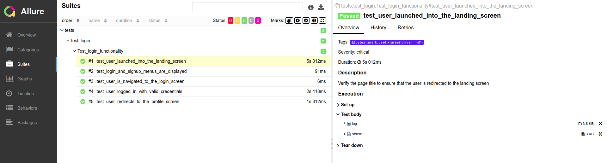

# README #

This README would normally document whatever steps are necessary to get your application up and running.

### What is this repository for? ###

* Sample Selenium with Python project (pyTest framework)

### Pre-Requisite ###

* Python, PIP3
* Pycharm
* install the dependencies in `requirements.txt` file

### Getting Started ###

* git clone https://github.com/ap-prasanthap/undostres.git
* Navigate to `master`
* For running, click and run the bash file `automation.sh`

### Reports used ###

* Allure
* For viewing the report open the `index.html` from the allure-report folder

### Sample Report ###

